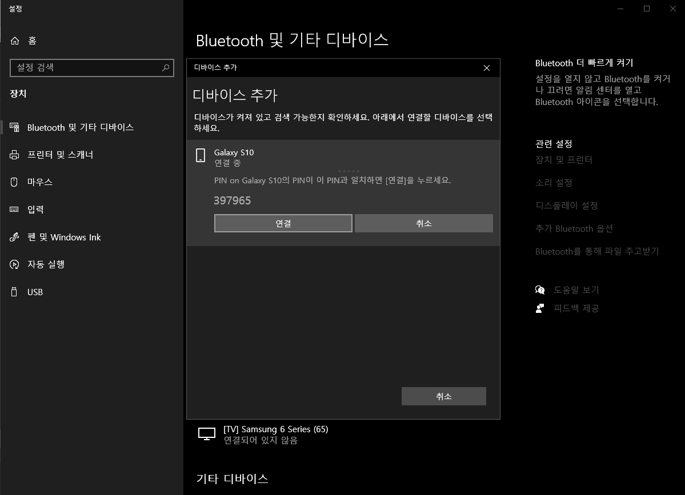
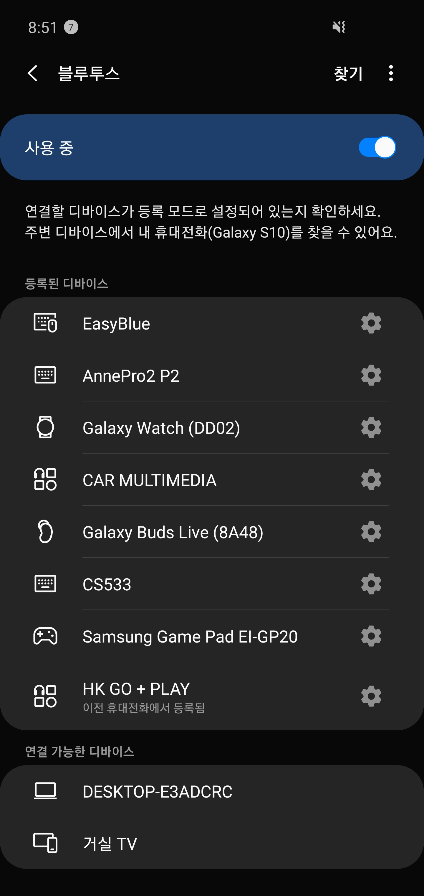
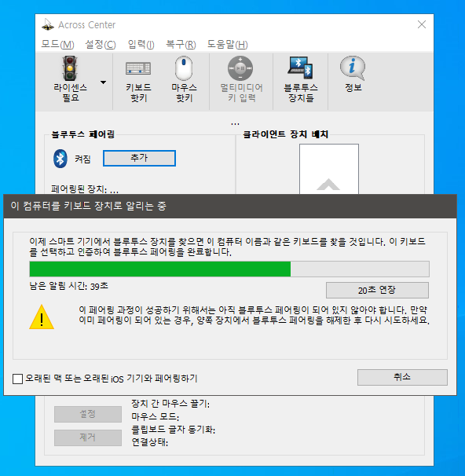
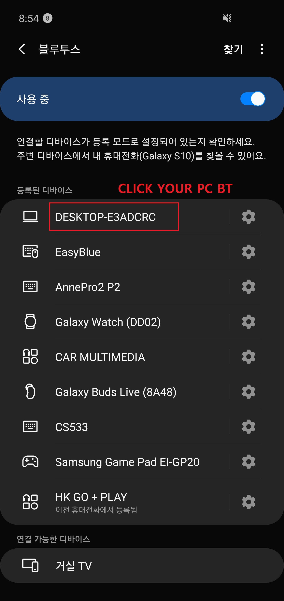
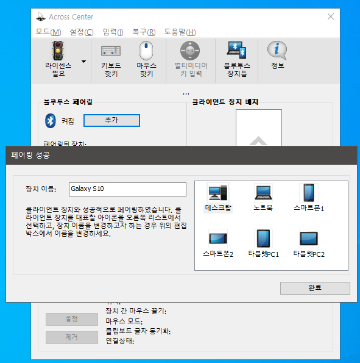
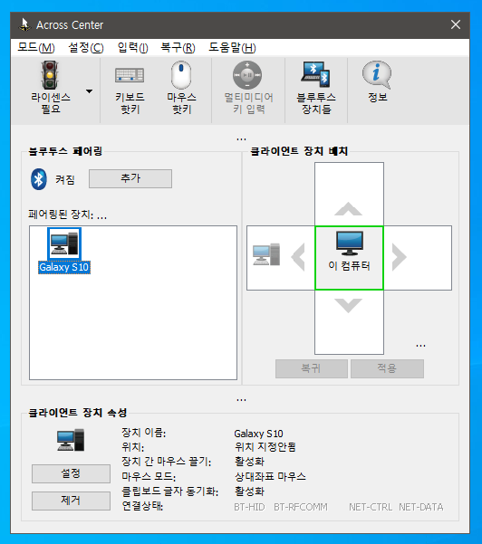
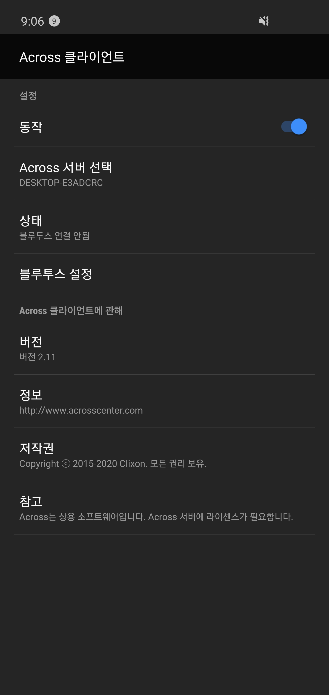

# keyboard

## FC660M
http://www.leaderskey.com/shop/item.php?it_id=1508494426  
about $100

## COX CK87  
http://www.coxenc.co.kr/sub/product/product_view.aspx?no=259  
about $44.51

## K660 ARC 
https://abkoncore.com/post/523  
about $40.40

## Anne Pro 2  
http://en.obins.net/obinskit  
about $90

How to bluetooth paraing  
FN2 + 1 or 2 or 3 or 4 pressing for 5 sec    
https://www.reddit.com/r/AnnePro/comments/9ba8pn/anne_pro_2_bluetooth_will_not_connect/  

## EasyBlue  
http://www.easyblue.co.kr/product/product.html  
$32.22

You case see programe at 

## synergy for 32bits
https://sourceforge.net/projects/synergy-stable-builds/files/v1.8.8-stable/  
If you use 32 bits OS, you can use this for software KVM.  
synergy-v1.8.8-stable-Windows-x86.msi

## barrier
https://github.com/debauchee/barrier  

## ahk
https://github.com/al-hub/ahk/blob/master/660m.ahk  

## across  
http://www.acrosscenter.com  
$22.99 for 1year

||windows|android|
|:---|:---:|:---:|
|0.prepare program|server|client|
|1.bt connection|win+r → ms-settings:bluetooth → +Bluetooth or other device add → Bluetooth → Galaxy S10  ||
|2.across connection|||
||||
||||

## spacedesk
https://spacedesk.net/##box_434  
extend your windows pc screen to android phone/tablet
