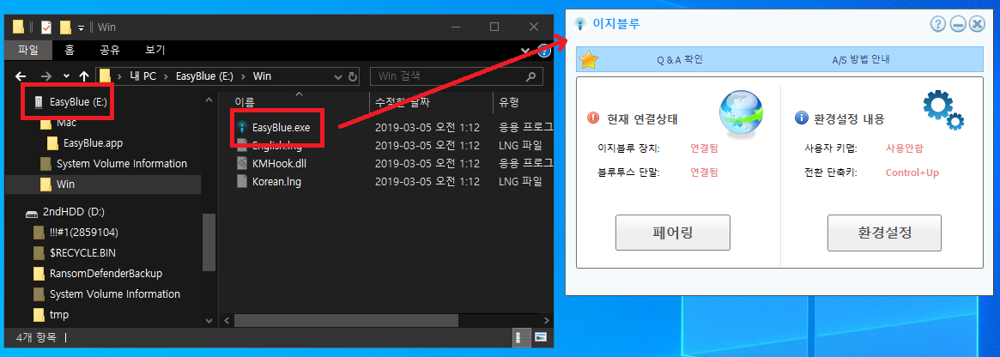

# keyboard

## Anne Pro 2  
http://en.obins.net/obinskit  

How to bluetooth paraing  
FN2 + 1 or 2 or 3 or 4 pressing for 5 sec    
https://www.reddit.com/r/AnnePro/comments/9ba8pn/anne_pro_2_bluetooth_will_not_connect/  

## EasyBlue  
http://www.easyblue.co.kr/product/product.html

You case see programe at 

## synergy for 32bits
If you use 32 bits OS, you can use this for software KVM.  
synergy-v1.8.8-stable-Windows-x86.msi
https://sourceforge.net/projects/synergy-stable-builds/files/v1.8.8-stable/

## barrier
https://github.com/debauchee/barrier  

## ahk
https://github.com/al-hub/ahk/blob/master/660m.ahk  

